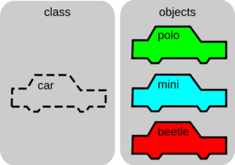

# CURSO JAVA

## Descrição

Este espaço será utilizado para anotações referentes ao meu estudo de Java. Serão inseridos resumos, explicações e códigos, assim como, projetos que serão realizados conforme o tempo.


## Programação Orientada a Objetos

Um dos intuitos da criação da *Programação Orientada a Objetos* foi o de aproximar o manuseio das estruturas de um programa ao manuseio das coisas do mundo real, daí o nome "objeto" como algo genérico que pode representar qualquer coisa tangível. Dessa forma, o paradigma (orientação a objetos) baseia principalmente em dois conceitos chaves: *classe* e *objetos*.

### O que são classes e objetos

Como um problema inicial, podemos pegar a compra de um carro como exemplo:
  - O carro novo seria um objeto;
  - As características do carro seriam os ATRIBUTOS (motor, cor, numero de portas...);
  - Seus comportamentos são ações ou MÉTODOS (acelerar, desacelerar, acender os faróis...).

O carro novo, é um objeto, mas na loja em que você comprou possuem diversos outros carros. Apesar do seu carro ser único, podem existir outros com exatamente os mesmo atributos, ou parecidos, ou até mesmo totalmente diferentes, mas ainda assim são considerados carros. Podemos dizer então que seu objeto pode ser classificado (isto é, seu *objeto* pertence à uma classe) como um carro, e seu carro nada mais é que um instância dessa classe chamada "carro".



### As principais características da POO

- **ENCAPSULAMENTO**
  
  Sabemos que um carro possui atributos e métodos, ou seja, características e comportamenteos. No entanto, se alguns desses atributos ou métodos forem facilmente visíveis e modificáveis, como o mecanismo de aceleração do carro, isso pode dar liberdade para que alterações sejam feitas, resultando em efeitos colaterais imprevisíveis. Usando essa analogia, uma pessoa pode estar insatisfeita com a aceleração do carro e modifica a forma como ela ocorre, criando efeitos colaterais que podem fazer o carro nem andar, por exemplo.

  Dizemos, nesse caso que o método de aceleração do seu carro não é visível por fora do próprio carro. Na POO, um atributo ou método que não é visível de fora para o próprio objeto é chamadao de "privado" (private) e quado é visível, é chamado de "público" (public).

  Mas como sabemos que o nosso carro acelera? Não sabemos. Nós só sabemso que para acelerar, devemos pisar no acelerador e de resto o objeto sabe ocmo executar essa ação sem expor como o faz. Dizemos que a aceleração do carro está *encapsulada*, pois sabemos o que ele vai fazer ao executarmos esse método, mas não sabemos como.

- **HERANÇA**

  Digamnos que iremos comprar um carro c X da versão *cross* que possui muito dos atributos da versão clássica, mas com algumas diferenças bem grandes para transitar em estradas de terra. Vemos então que não só alguns atributos como também alguns mecanismos (ou métodos, traduzindo para o POO) mudam, mas essa versão *cross* ainda é do modelo X, ou melhor, é um *tipo* do modelo.

  Quando dizemos que uma classe A é um tipo de classe B, dizemos que a classe A *herda* as características da classe B e que a classe B é *mãe* da classe A, estabelecendo então uma relação de **herença** entre elas.

- **INTERFACE**

  Muitos dos métodos dos carros são comuns em vários automóveis. Tanto um carro quanto uma motoclicleta são classes cujos objetos podem acelerar, parar, acender o farol etc, pois são coisas comuns a automóveis. Podemos dizer, então, que ambas as classes !corro" e "motocicleta" são "automóveis".

  Quando duas ou mais classes possuem comportamentos comuns que podem ser separados em uma outra classe, dizemos que a "classe comum" é uma *interface* , que podem ser herdadas por outras classes.

- **POLIMORFISMO**

  Consideramos que temos um carro e uma moto, a forma de aceleração de ambos é diferente. Entretanto, o método "mecanismo de aceleração" é diferente. Digamos que o método "mecanismo de aceleração" é uma forma de *polimorfismo*, pois dois objetos, de duas classes diferente, têm um mesmo método que é implementado de formas diferentes, ou seja, um método possui várias formas, varias implementações difrerentes em classes diferentes, mas que possuem o mesmo efeito.


### O que é Classe na Orientação a Objetos?

  Por definição, uma classe serve como um **modelo**, uma planta, um desenho por meio do qual objetos serão criados.

 **Exemplo em Java**
  

  ```
  public class Pessoa {
    public String nome;
    public String email;
    public String cpf;
  }
  ```

  Em uma classe além das **características (propriedades)** comuns aos objetos, temos também os **comportamentos** que aquele objeto pode executar.

  **Exemplo em Java**

  ```
  public class Pessoa {
    public String nome;
    public String email;
    public String cpf;

    public String exibirDados() {
      return "=== Dados da Pessoa ===" + "\n" +
              "Nome: " + this.nome + "\n" +
              "Email: " + this.email + "\n" +
              "CPF: " + this.cpf;
    }
  }
  ```

  ### Convenções do código em Java

  - Nomes de classes devem começar com letra maiúscula e usar a convenção PascalCase (também conhecida como Upper CamelCase);

  - Nomes de métodos devem começar com letra minúscula e usar a convenção camelCase;

  - Nomes de constantes devem ser totalmente em letras maiúsculas, separadas por underline;

  - Nomes de variáveis devem começar com letra minúscula e usar a convenção camelCase;

  - Todas as linhas de código devem ter no máximo 80 caracteres de largura para facilitar a leitura;

  - Recomenda-se usar espaços em branco para separar operadores, palavras-chave e elementos de controle de fluxo;

  - Use comentários para documentar seu código, explicando o que ele faz e por que ele faz isso. Comentários devem ser claros e concisos.
